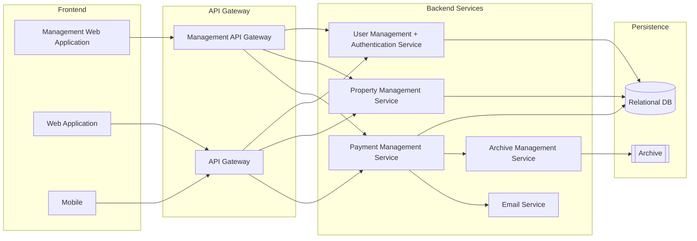

# Microservice Architecture

```mermaid
flowchart LR
  subgraph Frontend
    Web1[Management Web Application]
    Web2[Web Application]
    Mobile[Mobile]
  end

  subgraph APIGW[API Gateway]
    ManagementGateway[Management API Gateway]
    Gateway[API Gateway]
  end

  subgraph Backend["Backend Services"]
    UMS[User Management + Authentication Service]
    Property[Property Management Service]
    Finance[Payment Management Service]
    File[Archive Management Service]
    Email[Email Service]
  end

  subgraph Persistence
    DB[(Relational DB)]
    Archive[[Archive]]
  end

  Web1 --> ManagementGateway
  Web2 --> Gateway
  Mobile --> Gateway

  ManagementGateway --> UMS
  ManagementGateway --> Property
  ManagementGateway --> Finance
  Gateway --> UMS
  Gateway --> Property
  Gateway --> Finance

  UMS --> DB
  Property --> DB
  Finance --> DB
  Finance --> File
  File --> Archive
  Finance --> Email
```
