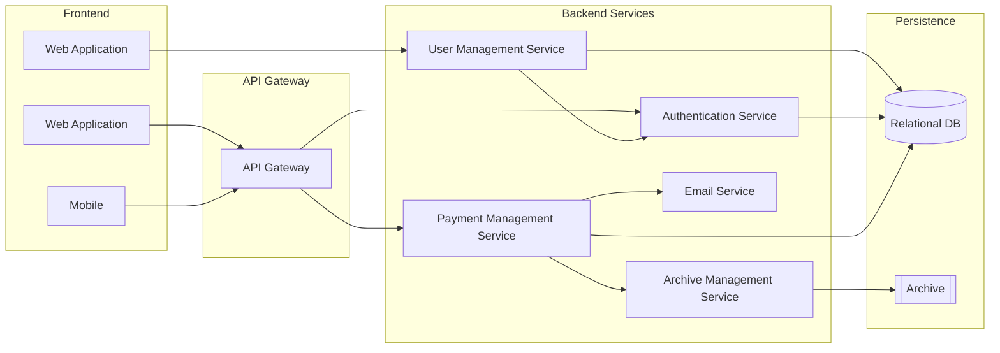

# Microservice Architecture

```mermaid
flowchart LR
  subgraph Frontend
    Web1[Web Application]
    Web2[Web Application]
    Mobile[Mobile]
  end

  subgraph APIGW[API Gateway]
    Gateway[API Gateway]
  end

  subgraph Backend["Backend Services"]
    UMS[User Management Service]
    Auth[Authentication Service]
    Finance[Payment Management Service]
    File[Archive Management Service]
    Email[Email Service]
  end

  subgraph Persistence
    DB[(Relational DB)]
    Archive[[Archive]]
  end

  Web1 --> UMS
  Web2 --> Gateway
  Mobile --> Gateway

  Gateway --> Auth
  Gateway --> Finance

  UMS --> Auth
  UMS --> DB
  Auth --> DB
  Finance --> DB
  Finance --> File
  File --> Archive
  Finance --> Email
```
